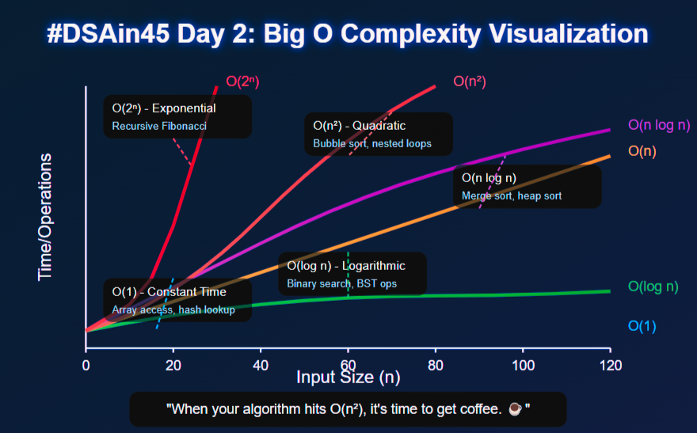
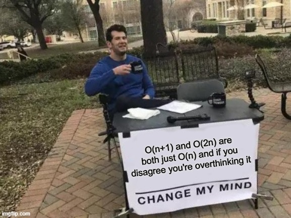

# 🚀 DAY 2: Time & Space Complexity - The Art of Not Making Your Computer Cry #DSAin45

Welcome to Day 2 of our journey! Yesterday we set up our environment - today we'll learn why some algorithms make your laptop sound like it's preparing for takeoff. 🛫

## 🤔 Why Do We Care About Efficiency?

Imagine two chefs both making the same cake:

- Chef A: Meticulously measures ingredients one by one, washes each utensil after use, and follows a convoluted recipe
- Chef B: Preps all ingredients first, uses efficient techniques, and follows a streamlined process

Both produce the same cake, but Chef B finishes hours earlier! In programming, we want to be Chef B.

_When my code takes too long to run, I don't wait patiently... I just assume the universe is broken._ 😂

## ⏱️ Time Complexity: How Long Does It Take?

Time complexity measures how an algorithm's runtime grows relative to its input size. We use **Big O Notation** to express this.

### Common Time Complexities (from best to "maybe go get coffee"):

- **O(1) - Constant Time**: "I don't care how much data you give me, I'll finish in the same time."

  - Example: Accessing an array element by index
  - _Like finding your favorite shirt when you know exactly which hanger it's on_

- **O(log n) - Logarithmic Time**: "Each step eliminates half the possibilities."

  - Example: Binary search
  - _Like finding a word in a dictionary - you don't check every page_

- **O(n) - Linear Time**: "If you double the input, I'll take twice as long."

  - Example: Finding the maximum value in an unsorted array
  - _Like checking every card in a deck to find the ace of spades_

- **O(n log n) - Linearithmic Time**: "Not great, not terrible."

  - Example: Efficient sorting algorithms (merge sort, heap sort)
  - _Like sorting books by both title and author_

- **O(n²) - Quadratic Time**: "Houston, we have a problem."

  - Example: Bubble sort, insertion sort
  - _Like comparing every person in a room with every other person_

- **O(2ⁿ) - Exponential Time**: "I'll see you next week... maybe."

  - Example: Recursive Fibonacci without memoization
  - _Like trying every possible combination on a lock_

- **O(n!) - Factorial Time**: "Maybe go on vacation and check when you get back."

  - Example: Solving the traveling salesman problem by checking all routes
  - _Like arranging 10 people in every possible seating order... all 3,628,800 of them_

---




## 💾 Space Complexity: How Much Memory Are We Hogging?

Space complexity measures the additional memory your algorithm needs as input size grows.

_My laptop when I accidentally create an O(n²) data structure: "I didn't sign up for this."_ 😅

### Common Space Complexities:

- **O(1) - Constant Space**: "I only need a fixed amount of extra memory."

  - Example: Finding the maximum value in an array
  - _Like needing just one cup regardless of how much coffee you're brewing_

- **O(n) - Linear Space**: "I need memory proportional to input size."

  - Example: Creating a new array with the same length as the input
  - _Like needing one sheet of paper for each guest on your list_

- **O(n²) - Quadratic Space**: "I need memory proportional to input size squared."
  - Example: Creating a 2D matrix based on input size
  - _Like needing a comparison chart for every person paired with every other person_

## 🔍 How to Analyze Your Algorithm

Follow these steps to analyze any algorithm:

1. Identify the input size 'n'
2. Count operations in the worst case
3. Drop constants and lower-order terms
4. Express in Big O notation

### Example Analysis:

```cpp
// What's the time complexity?
int sum = 0;
for (int i = 0; i < n; i++) {  // n iterations
    sum += arr[i];             // O(1) operation
}
// Total: O(n)

// How about this one?
for (int i = 0; i < n; i++) {      // n iterations
    for (int j = 0; j < n; j++) {  // n iterations for each i
        cout << i * j << endl;      // O(1) operation
    }
}
// Total: O(n²)
```

## 🔮 The "Master Theorem" for Divide & Conquer

For algorithms that divide problems into subproblems of size n/b, solve them, and combine in O(nᵏ) time:

- If work to combine solutions < work to solve subproblems: O(n^(log_b a))
- If work to combine solutions = work to solve subproblems: O(n^(log_b a) \* log n)
- If work to combine solutions > work to solve subproblems: O(nᵏ)

_Don't worry if this makes your brain hurt. Even senior engineers google this._ 😉

## 💡 Why This Actually Matters

Time and space complexity are crucial because:

1. **Scale**: An O(n²) algorithm might work fine for 100 elements but crash your system with 1,000,000 elements

2. **Mobile & Embedded**: On resource-constrained devices, inefficient algorithms can drain batteries or exceed memory limits

3. **Cost**: In cloud computing, inefficient algorithms literally cost more money

4. **User Experience**: No one wants to wait 10 seconds for a webpage to load

5. **Interviews**: The difference between "You're hired!" and "We'll keep your resume on file" (Translation: "Who's next?")

## 🧠 Common Complexity-Improving Techniques

- **Hash Tables**: Turn O(n) lookups into O(1)
- **Binary Search**: Turn O(n) searches into O(log n)
- **Dynamic Programming**: Avoid redundant calculations
- **Divide and Conquer**: Split problems into manageable subproblems

## 🔍 Practice Time:

What's the time and space complexity of this code?

```cpp
bool containsDuplicate(vector<int>& nums) {
    unordered_set<int> seen;
    for (int num : nums) {
        if (seen.count(num) > 0) {
            return true;
        }
        seen.insert(num);
    }
    return false;
}
```

_Answer in the comments! We'll discuss the solution tomorrow._

## 🤓 Tomorrow's Preview: Arrays in C++

Tomorrow we'll dive into arrays - the foundation of many data structures. We'll learn how memory actually works, why array access is O(1), and why "off-by-one" errors make programmers wake up in cold sweats.

What complexity analysis questions are giving you nightmares? Ask below!

#DSAin45 #Day2 #BigONotation #AlgorithmAnalysis #CodingInterview #CPlusPlus #ComputerScience
